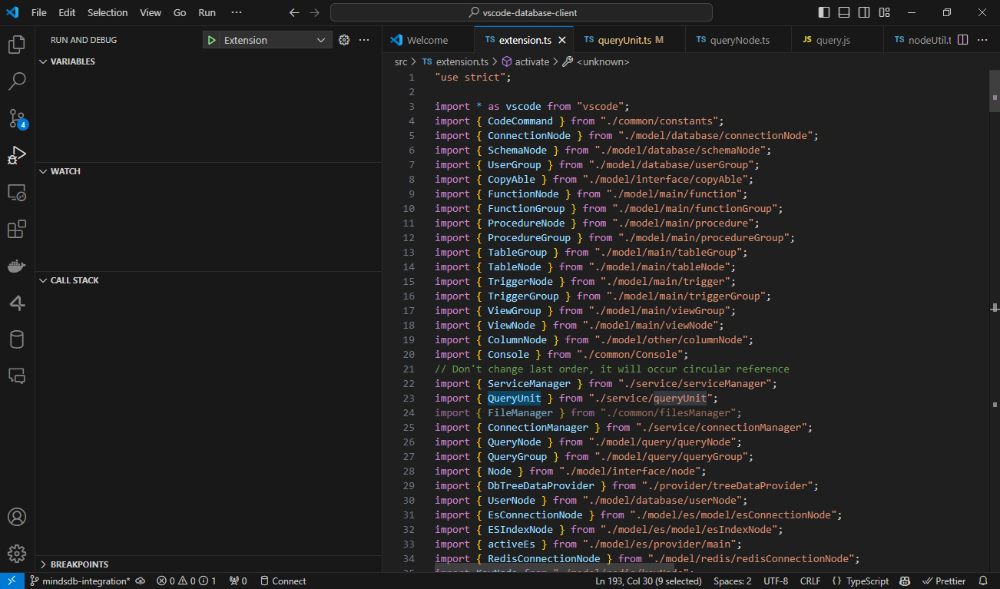
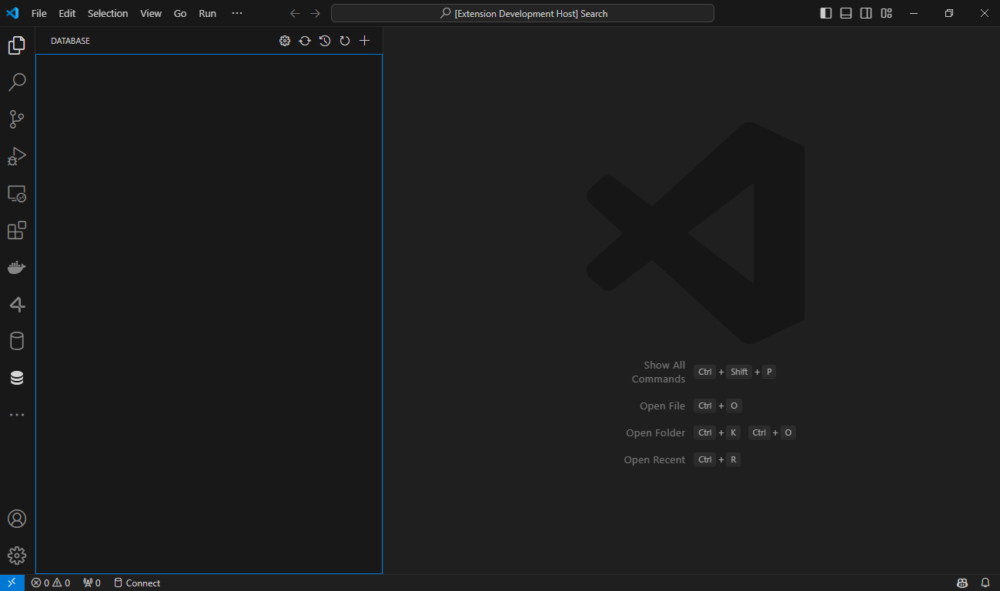
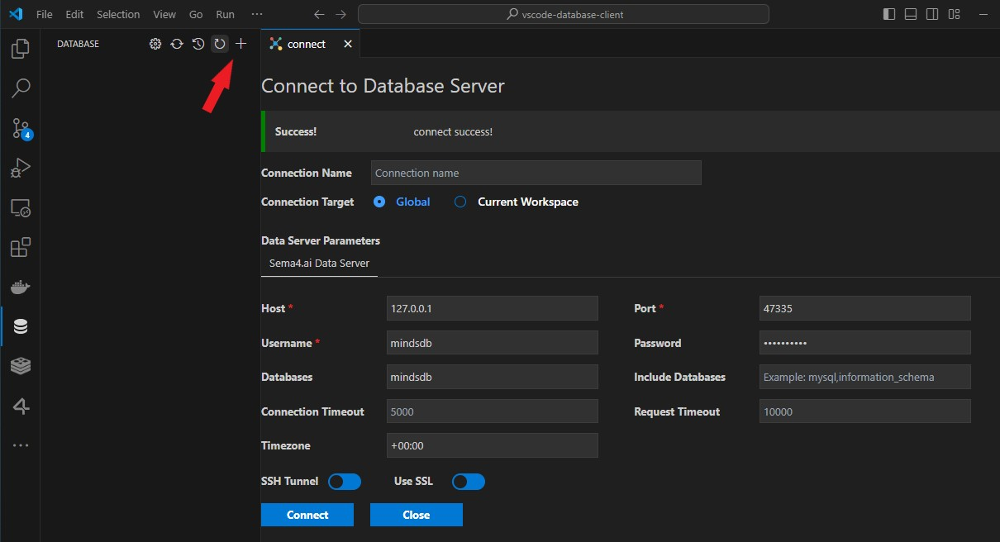

# Sema4 AI Database Client for Visual Studio Code

---

This project is a database client for VSCode to connect to Sema4 AI data server to browse the data sources and execute SQL queries

> Project site: [vscode-database-client](https://github.com/Sema4AI/vscode-database-client)

## Features

- [Database Client](#database-client)
  - [Connect](#connect)
  - [Table](#table)
  - [Execute SQL Query](#execute-sql-query)
  - [History](#history)

## Run the extension locally

1. Uninstall previously installed version of the extension.
2. Run the following command
   ```
   npm install
   ```
3. Open the source code in VS Code
4. Open the file [src/extension.ts](src/extension.ts)
5. Go to Run And Debug panel in VS Code and click Debug (Or just hit F5).
   
6. It will open a new VS Code window with the extension enabled.

   

## Run the extension locally

1. Uninstall previously installed version of the extension.
2. Run the following command
   ```
   npm install
   ```
3. Open the source code in VS Code
4. Open the file [src/extension.ts](src/extension.ts)
5. Go to Run And Debug panel in VS Code and click Debug (Or just hit F5).
   
   

7. It will open a new VS Code window with the extension enabled.

   


## Connect

1. Open Database Explorer panel, then click the `+` button.
2. Select your database type, input connection config then click the connect button.



Two panels are created because in some cases you need to view both SQL and NoSQL data at the same time, you can drag the panel to the other by long-pressing.

## Table

1. Click table to open table view.
2. Click button beside table to open new table view.
3. Then you can do data modification on the table view.


## Execute SQL Query

In the Database Explorer panel, click the `Open Query` button.


That will open a SQL editor bind of database, it provider:

1. IntelliSense SQL edit.
2. snippets:`sel、del、ins、upd、joi`...
3. Run selected or current cursor SQL (Shortcut : Ctrl+Enter).
4. Run all SQL (Shortcut : Ctrl+Shift+Enter).

Note: The extension is developed using Nodejs. Nodejs does not allow duplicate name attributes, so you need to avoid columns with the same name in your query, otherwise the results will not be displayed in full.


## Cache

In order to improve performance, the database information is cached. If your database structure changes externally, you need to click the refresh button to refresh the cache。


## History

Click the history button to open the list of recently executed query history records.


## Credits

- [sql-formatter](https://github.com/zeroturnaround/sql-formatter) Sql format lib.
- [umy-ui](https://github.com/u-leo/umy-ui): Result view render.
- [ssh2](https://github.com/mscdex/ssh2): SSH client.
- Client Lib:
  - [node-mysql2](https://github.com/sidorares/node-mysql2) : MySQL client.
  - [node-postgres](https://github.com/brianc/node-postgres): PostgreSQL client.
  - [tedious](https://github.com/tediousjs/tedious): SqlServer client.
  - [ioredis](https://github.com/luin/ioredis): Redis client.
  - [vscode-sqlite](https://github.com/AlexCovizzi/vscode-sqlite): SQLite client code reference.
